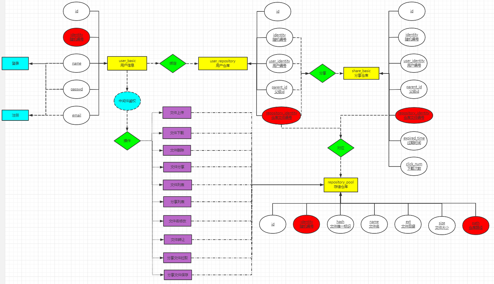
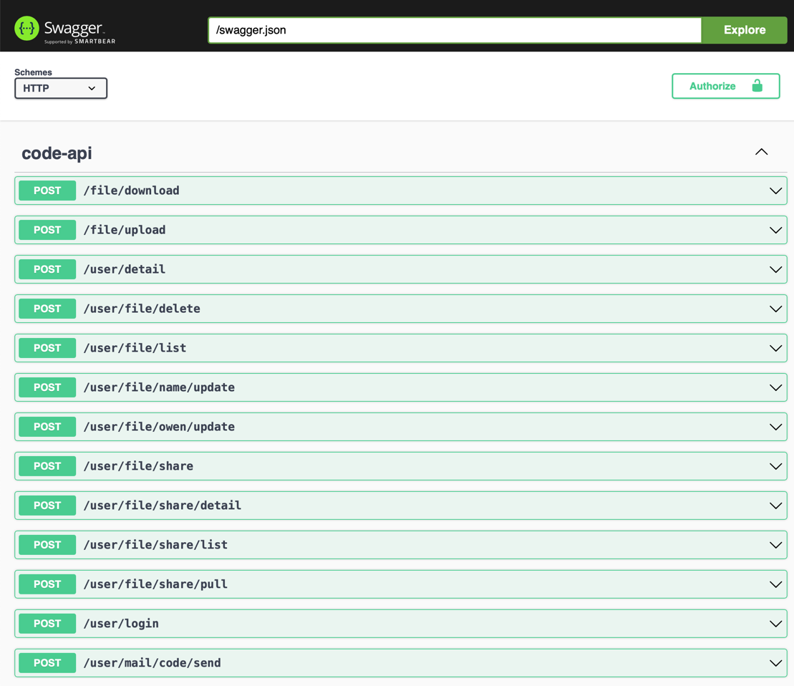
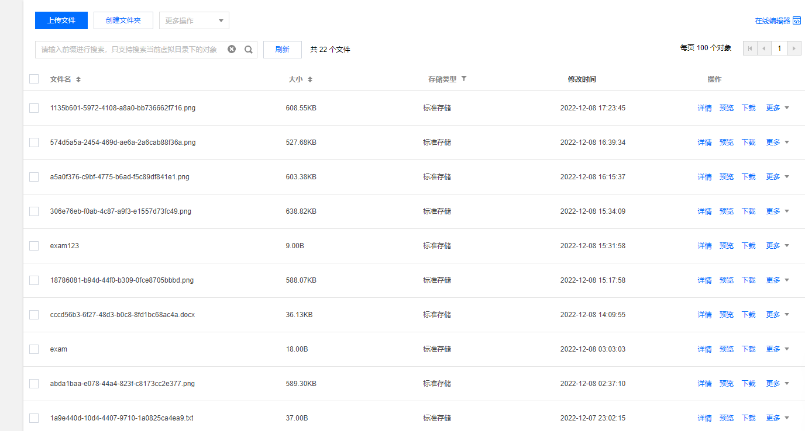
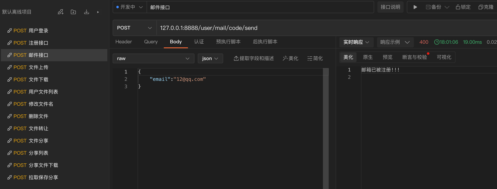
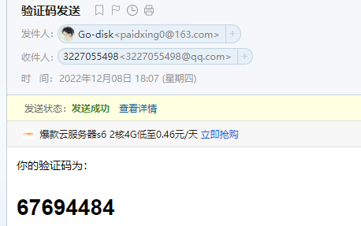
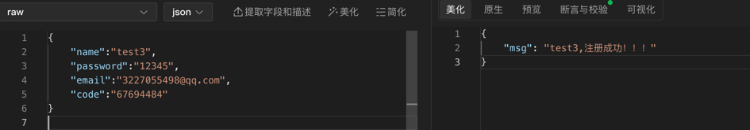
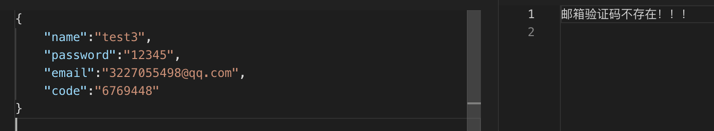

# go-disk 云盘管理接口
> go-zero、xorm、Redis、MySQL、Jwt、腾讯云cos
> 
> 
```text
goctl api new code
cd code
go mod init
go mod tidy

启动服务
go run code.go -f etc/code-api.yaml  
curl -i http://localhost:8888/from/you

通过api接口生成相应的路由和logic
goctl api go -api code.api -dir . -style go_zero
```
```text
安装goctl-swagger插件
go get -u github.com/zeromicro/goctl-swagger

生成JSON文件
goctl api plugin -plugin goctl-swagger="swagger -filename swagger/code.json" -api code.api -dir .

指定项目服务的host:port
goctl api plugin -plugin goctl-swagger="swagger -filename swagger/code.json -host 127.0.0.1:8888 -basepath /api" -api code.api -dir .

安装swagger
go get github.com/go-swagger/go-swagger
go install ./cmd/swagger

启动接口文档
swagger serve -F=swagger  swagger/code.json --port 8088 --host 0.0.0.0  --no-open

```
```text
邮箱服务
https://github.com/jordan-wright/email
```
- [x] 用户
  - [x] 用户登录
  - [x] 用户查询
  - [x] 邮箱验证
  - [x] 用户注册
  - [x] 验证码发送
- [x] 中间件
  - [x] Token鉴权
- [x] 存储仓库操作
  - [x] 文件上传
  （小文件上传，大了会413）
  - [x] 分块上传
  （大文件上传，这里遇到问题就是411，直接用FormFile像普通上传拿到就会这样，后面换成了bytes.NewReader(buf)，同样都是拿到一个reader为什么前者出错，另外留坑还有点小问题）
  - [x] 上传的文件添加到用户仓库
  - [x] 用户拥有文件列表
  - [x] 文件下载
  - [x] 文件名修改
  - [x] 文件软删除
- [x] 分享操作
  - [x] 文件分享
  - [x] 分享列表
  - [x] 分享文件下载，点击次数+1
  - [x] 分享文件拉取到用户仓库保存
  - [x] 更新文件所有者
   (文件所有权转让，不是单纯的分享文件，类似直接交易)








